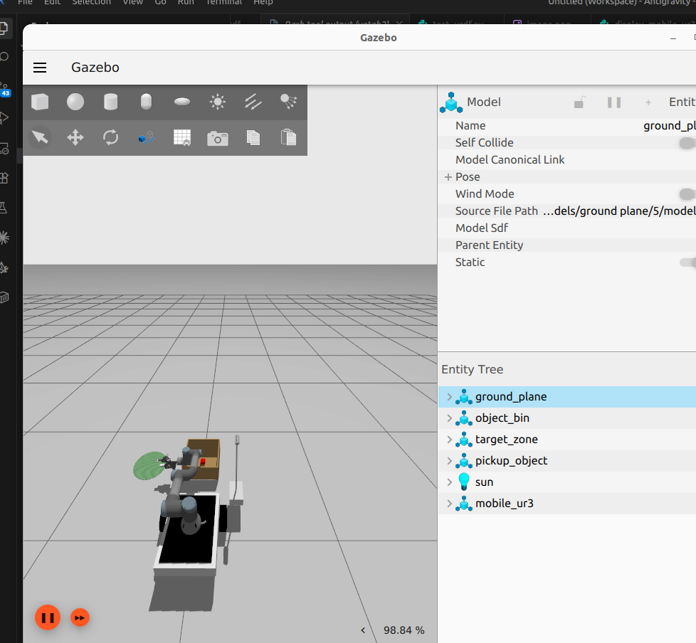

# ARES: Autonomous Robotic Environment System

[](https://docs.ros.org/en/jazzy/)
[](https://gazebosim.org/)
[](https://python.org)
[](https://opensource.org/licenses/MIT)

An **autonomous mobile manipulator** combining a differential-drive base with a 6-DOF UR3-based arm for open-vocabulary pick-and-place. The system has two complementary control paths:

- **Reinforcement Learning (SAC)** — a trained policy for direct low-level arm and base control, running at 20 Hz
- **VLA (Vision-Language-Action) pipeline** — language understanding + open-vocabulary vision + task planning, driving MoveIt2 for high-level task execution

Both run on top of **Nav2 + SLAM** for autonomous navigation. The mobile base relies on a specialized 4-point differential drive configuration featuring zero-friction caster wheels to support the mass of the 6-DOF UR3 manipulator. Visual observations are captured securely through a static environment camera to avoid jitter.




---

## What This Robot Can Do

1. **Understand natural language** — `"sort all objects by colour"` or `"pick the blue cube and place in the tray"`
2. **See any object** — open-vocabulary detection via OWLv2 (`"red coffee mug"`, `"yellow banana"`)
3. **Remember where things are** — persistent object map with 30s occlusion decay
4. **Plan multi-step tasks** — decompose sort/stack/clear goals into sequential pick-and-place actions
5. **Navigate autonomously** — Nav2 + SLAM + frontier-based exploration
6. **Stay safe** — real-time joint limit, workspace, and obstacle monitoring with e-stop

---

## Key Features

| Feature | Implementation |
|---------|----------------|
| **Language understanding** | SmolLM2-360M-Instruct (on-device, ~700 MB) + regex fallback |
| **Open-vocabulary vision** | OWLv2 base-patch16 (~590 MB) + HSV colour fallback |
| **Object memory** | Persistent timestamped map, 30s occlusion tolerance |
| **Task planning** | Sort-all, clear-all, stack, single pick-and-place |
| **RL control** | SAC (Stable-Baselines3), 16-dim obs, 8-dim continuous action |
| **Motion planning** | MoveIt2 MoveGroup action client + velocity fallback |
| **Navigation** | Nav2 AMCL + DWB, custom obstacle-avoidance FSM |
| **Exploration** | Frontier-based SLAM-aware autonomous exploration |
| **Safety** | Joint limits, workspace bounds, LiDAR e-stop at 20 Hz |
| **Sim-to-real** | Domain randomisation (position, colour, physics noise) |

---

## Reinforcement Learning

The RL system trains a **SAC (Soft Actor-Critic)** agent via [Stable-Baselines3](https://stable-baselines3.readthedocs.io/) in a custom Gymnasium environment (`PickPlaceEnv`) that wraps the live ROS 2 + Gazebo simulation. The agent learns a **6-phase curriculum** (approach → lower → grasp → lift → transport → place).

### Observation Space (24-dim)

| Slice | Dimensions | Description |
|-------|-----------|-------------|
| `joint_positions` | 6 | UR3 arm joint angles |
| `joint_velocities` | 6 | UR3 arm joint velocities |
| `finger_position` | 1 | Gripper finger position |
| `end_effector_pos` | 3 | EE position (x, y, z) via FK |
| `object_pos` | 3 | Target object position |
| `object_grasped` | 1 | Binary grasp flag |
| `current_phase` | 1 | Task phase (0-5) |
| `base_pose` | 3 | Mobile base (x, y, θ) |

### Action Space (9-dim, continuous in [-1, 1])

| Slice | Dimensions | Description |
|-------|-----------|-------------|
| `joint_velocities` | 6 | UR3 arm joint velocity commands |
| `gripper_control` | 1 | Open / close gripper |
| `base_linear_vel` | 1 | Forward / backward base speed |
| `base_angular_vel` | 1 | Rotational base speed |

### Training

```bash
# Train SAC with Gazebo visualization (recommended)
./src/pickplace_rl_mobile/launch/run_rl_training.sh

# Monitor training
tensorboard --logdir ./rl_models/tensorboard
```

Checkpoints are saved to `./rl_models/` every 10 000 steps. The best model (by eval reward) is saved as `best_model.zip`.

### Inference

The trained policy runs inside `manip_rl_node` at **20 Hz**. It subscribes to live perception output (object pose from the VLA vision node) and publishes joint velocity commands + base `cmd_vel`.

```bash
# Run the trained RL policy node
ros2 run pickplace_rl_mobile manip_rl_node --ros-args -p model_path:=./rl_models/best_model.zip
```

---

## VLA Pipeline

```
User text  →  SmolLM2 (language)  →  Task Planner  →  Coordinator
                                                           ↑
Camera     →  OWLv2 (vision)      →  Object Memory  ──────┘
                                                           ↓
                                                    MoveIt2 Action Node
```

Six nodes, each independently testable:

| Node | Purpose |
|------|---------|
| `vla_language_node` | Text → structured JSON (SmolLM2 / regex) |
| `vla_vision_node` | Camera → object poses (OWLv2 / HSV) |
| `object_memory_node` | Persistent object map with decay |
| `task_planner_node` | Multi-step task decomposition |
| `vla_coordinator_node` | Resolves poses and drives execution |
| `vla_action_node` | MoveIt2 motion planning + gripper |

---

## Quick Start

```bash
# Install ML dependencies (optional — graceful fallback without them)
pip install transformers torch pillow stable-baselines3 gymnasium

# Build
colcon build --packages-select pickplace_rl_mobile
source install/setup.bash

# Launch VLA pipeline (all 6 nodes)
ros2 launch pickplace_rl_mobile vla_full_pipeline.launch.py

# Launch without ML models (zero extra dependencies)
ros2 launch pickplace_rl_mobile vla_full_pipeline.launch.py use_llm:=false use_owlv2:=false

# Send a command
ros2 topic pub /vla_instruction std_msgs/String "data: 'pick the blue cube and place in tray'"

# Multi-step task
ros2 topic pub /vla_instruction std_msgs/String "data: 'sort all objects by colour'"

# Full system (Gazebo + perception + safety + Nav2)
ros2 launch pickplace_rl_mobile full_system.launch.py use_nav2:=true

# RL training
ros2 launch pickplace_rl_mobile rl_train.launch.py
tensorboard --logdir ./rl_models/tensorboard
```

---

## Documentation

- **[docs/vla_concepts.md](./docs/vla_concepts.md)** — VLA architecture, node reference, launch guide, ML setup
- **[docs/system_architecture_and_improvements.md](./docs/system_architecture_and_improvements.md)** — Full system architecture, topic reference, roadmap
- **[docs/robot_architecture.md](./docs/robot_architecture.md)** — URDF, hardware specs, sensor configuration

---

## Maintainer

**Darsh Menon** — [darshmenon02@gmail.com](mailto:darshmenon02@gmail.com) · [@darshmenon](https://github.com/darshmenon)
