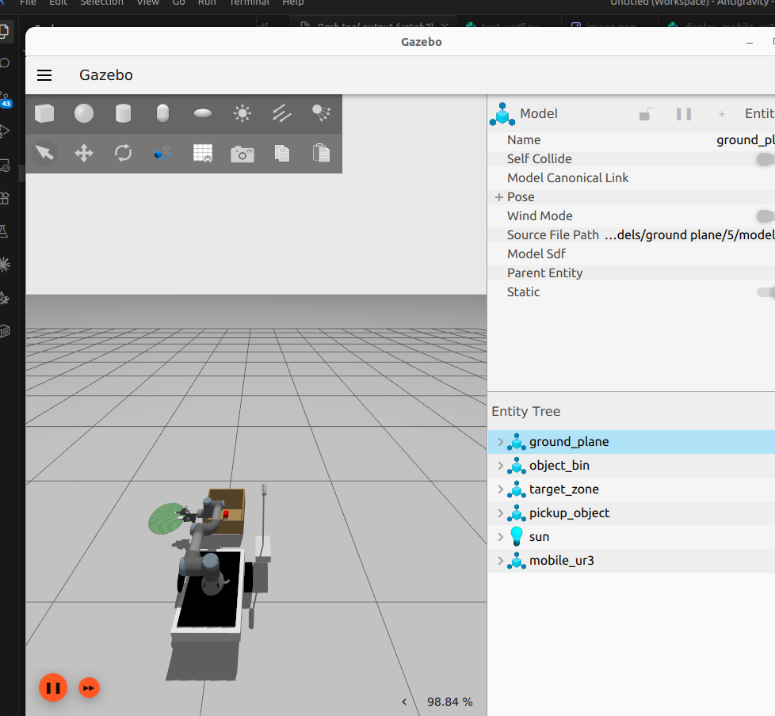

# ARES: Autonomous Robotic End-to-End System — UR3 Mobile Pick & Place via RL

[](https://docs.ros.org/en/humble/)
[](https://gazebosim.org/)
[](https://python.org)
[](https://github.com/Stable-Baselines-Team/stable-baselines3-contrib)
[](https://opensource.org/licenses/MIT)

> **Platform:** ROS2 Humble · Gazebo Harmonic · Ubuntu 22.04 · CUDA

A mobile manipulator that learns pick-and-place via **RL + a scripted pre-grasp routine** — no demonstrations, no motion planning in the loop. A differential-drive base carries a 6-DOF UR3 arm with a Robotiq 2F-85 gripper. A scripted controller handles base approach and arm pre-positioning; **TQC** (Truncated Quantile Critics) learns the manipulation stages from dense reward shaping.



---

## What it does

| Step | Description |
|------|-------------|
| **1. Pre-grasp** | Scripted P-controller faces robot toward object, keeps caster clear of bin wall, extends arm (shoulder=-1.7, elbow=2.0, wrist=-1.0) |
| **2. Approach** | RL lowers EE to object height and closes XY distance simultaneously |
| **3. Grasp** | RL positions the gripper around the pickup cube and closes fingers |
| **4. Lift** | RL raises grasped object to 25cm clearance height |
| **5. Transport** | RL drives base toward drop zone while holding object |
| **6. Place** | RL lowers and releases object at target location |

---

## Highlights

- **No motion planning** — one TQC policy controls 6 arm joints + gripper + base simultaneously
- **Phase-based curriculum** — 5 phases, milestone bonuses (+100 to +1000), retreat penalized 3–4× harsher than approach
- **Analytical FK** — UR3 DH parameters give EE world position with zero TF latency
- **Real Gazebo poses** — `ros_gz` dynamic_pose bridge gives ground-truth object position, no fake randomisation
- **Grasp verification** — object lift checked against real Gazebo pose for up to 80 steps before confirming success
- **VecNormalize** — online normalisation of all 46 obs dims + reward, critical for mixed-scale inputs
- **Caster-aware pregrasp** — front caster (r=6cm, x=+30cm from chassis) kept clear of bin wall as the arm reaches over it

---

## RL System

### Algorithm: TQC (Truncated Quantile Critics)

Upgraded from SAC (best reward: −328). TQC distributes return estimates across multiple quantile networks and truncates the top quantiles before Bellman updates, suppressing Q-value overestimation for more stable grasping.

| Hyperparameter | Value | Why |
|---------------|-------|-----|
| Policy network | `[512, 512, 512]` | Deeper than default [256,256] for the 46-dim → 9-dim mapping |
| `gradient_steps` | 4 | Higher sample efficiency |
| `buffer_size` | 500,000 | Off-policy replay buffer |
| `batch_size` | 512 | Stable gradients |
| `gamma` | 0.99 | Long-horizon discounting for the multi-phase task |
| `learning_starts` | 1,000 | Random exploration before first update |
| `VecNormalize` | `clip_obs=10` | Online obs normalisation; eval env uses frozen stats |
| `top_quantiles_to_drop` | 2 | Conservative Q-targets |

---

### Observation Space — 46 dimensions

| Field | Dim | Notes |
|-------|-----|-------|
| `joint_positions` | 6 | UR3 arm angles (rad) |
| `joint_velocities` | 6 | UR3 arm speeds (rad/s) |
| `finger_position` | 1 | 0 = open, ~0.8 = fully closed |
| `ee_pos` | 3 | EE XYZ in **world frame** via DH FK |
| `obj_pos` | 3 | Object XYZ from Gazebo dynamic_pose bridge |
| `ee_to_obj` | 3 | Direct tracking vector from EE to object |
| `ee_to_target` | 3 | Vector from EE to placement target |
| `obj_to_target` | 3 | Vector from object to placement target |
| `obj_in_base` | 3 | Object position expressed in base frame |
| `gripper_error` | 1 | Error to desired open/closed gripper state |
| `object_grasped` | 1 | Binary — updated by grasp verification |
| `current_phase` | 1 | Integer phase (1–5) |
| `base_pose` | 3 | Base x, y, heading θ from odometry |
| `prev_action` | 9 | Previous action for temporal smoothing/context |

All quantities share the **world frame** — no mixed-frame distance bugs.

---

### Action Space — 9 dimensions (continuous, clipped to [−1, 1])

| Field | Dim | Notes |
|-------|-----|-------|
| `joint_deltas` | 6 | Position delta per arm joint; max ±0.25 rad/step, P-controlled to velocity |
| `gripper` | 1 | >0 → close at 0.5 rad/s, <0 → open |
| `base_linear` | 1 | Forward speed (×0.5 m/s); **zeroed in phases 1–3** |
| `base_angular` | 1 | Turn speed (×1.0 rad/s); **zeroed in phases 1–3** |

Position-delta control (not raw velocity) gives a stable zero-action baseline — the arm holds still when the policy outputs 0.

---

### 5-Phase Curriculum

| Phase | Goal | Reward Signal | Transition Condition |
|-------|------|---------------|---------------------|
| **1** | Lower EE to grasp height + close XY to object | `Δdist × 100` approach / `× 300` retreat | `dist_z < 4 cm AND dist_xy < 6 cm` |
| **2** | Reach object and close gripper | `Δdist × 80 / × 320` + proximity/touch bonuses | Gripper > 0.7 AND dist < 4 cm |
| **3** | Lift object to 25 cm | `Δheight × 100 / × 200` | EE height within 5 cm of 25 cm |
| **4** | Transport to drop zone | `Δdist × 50` base + arm | EE within 15 cm of target XY |
| **5** | Lower and release | `Δdist × 50` | EE within 8 cm, gripper open |

**Milestone bonuses:** +100 (phases 1, 3, 4, 5), +1000 (grasp success at phase 2).

`CurriculumCallback` in `train_rl.py` drives stage transitions from thresholds in `config/curriculum.yaml`. Default mode advances/reverts on fixed eval-reward thresholds. `--adaptive-curriculum` instead advances once eval reward plateaus (rolling improvement below `epsilon` over `window` evals), gated by a `floor_ratio` safety floor so a fast-learning stage can move on sooner without dropping below the fixed-mode minimum bar.

---

### Hyperparameter Tuning

Per-algorithm hyperparameters live in `config/algo_hparams.yaml`, loaded by `agent_factory.hparams_for()` — edit it to sweep values (learning rate, `tau`, `top_quantiles_to_drop_per_net`, ...) without touching `train_rl.py` or `agent_factory.py`. Missing keys/algorithms fall back to `agent_factory._DEFAULT_HPARAMS`.

For automated search, `optimize_rl.py` runs an Optuna study: each trial trains fresh in a single Gazebo world for a short budget, scored on final eval reward, with a median pruner killing trials that fall behind.

```bash
ros2 run pickplace_rl_mobile optimize_rl --n-trials 20 --timesteps-per-trial 30000 \
  --algo tqc --curriculum-stage 1 --storage sqlite:///rl_models/optuna/study.db
```

A short trial can't reach the full 5-phase task — treat the winning config (written to `rl_models/optuna/<study-name>_best_hparams.yaml`) as a starting point to merge into `config/algo_hparams.yaml` and verify with a full `train_rl.py` run. `--storage` makes the study resumable; omit it for a quick in-memory search.

---

Per-step reward is potential-based shaping (distance reduction × phase scale, retreat penalised 3–4× harsher than approach) plus proximity/alignment bonuses and safety terminations (out-of-bounds, EE underground, runaway joint velocity). Full breakdown: **[CONCEPTS.md §4](./CONCEPTS.md#4-potential-based-reward-shaping)**; constants live in `pickplace_env.py::compute_reward()`.

---

## Architecture

```
Episode reset()
    ├── Randomise object XY ±4 cm (domain randomisation)
    ├── Scripted pre-grasp (P-controller, up to 300 steps):
    │       · Turn base to face object
    │       · Drive forward only while chassis_x ≤ 0.16 m
    │         (keeps 6 cm front caster clear of bin back wall at x≈0.40 m)
    │       · Extend arm: pan=0, shoulder=-1.7, elbow=2.0, wrist_1=-1.0
    │       · Break when EE within 30 cm XY of object
    └── Hand off to RL at phase 1

RL step()  (~40 Hz)
    ├── Spin ROS node (joint_states, odom, dynamic_pose)
    ├── Compute DH FK → EE world position
    ├── Execute action (position-delta arm + gripper + base)
    ├── Compute phase reward + check transitions
    └── Return (obs, reward, terminated, truncated)
```

**FK pipeline:** UR3 DH parameters compute EE analytically. A 180° yaw on `base_link_inertia` flips the FK output (x→−x, y→−y) before adding the arm mount offset, giving EE in chassis frame, then world frame via odometry.

---

## Setup

```bash
# Clone
git clone https://github.com/darshmenon/pickplace-rl-mobile.git
cd pickplace-rl-mobile

# ROS
source /opt/ros/humble/setup.bash

# Python deps
pip install stable-baselines3 sb3-contrib gymnasium tensorboard

# Build the workspace
colcon build --packages-select pickplace_rl_mobile --symlink-install
source install/setup.bash
```

If you open a new terminal later, run:

```bash
cd /path/to/pickplace-rl-mobile
source /opt/ros/humble/setup.bash
source install/setup.bash
```

---

## Quick Start

Assumes **Setup** above is done (workspace built, sourced). Run the best saved policy in Gazebo:

```bash
ros2 launch pickplace_rl_mobile full_system.launch.py \
  use_rl:=true \
  use_perception:=false \
  model_path:=./rl_models/best_model/best_model.zip
```

`use_perception:=false` uses the world-file fallback object pose `[0.6, 0.0, 0.1325]`, matching the red pickup box in `pickplace_world.world`.

To train or resume training, jump to **Launch Guide → RL training** below — it starts Gazebo and the trainer together with the wiring used by the current checkpoints. Most common:

```bash
bash src/pickplace_rl_mobile/launch/run_rl_training.sh --resume-best --headless
```

---

## Launch Guide

### RL training

```bash
bash src/pickplace_rl_mobile/launch/run_rl_training.sh --resume-best --headless
```

| Flag | Effect |
|------|--------|
| `--resume-best` / `--resume-latest` / `--fresh` / `<checkpoint.zip>` | Which weights to start from |
| `--headless` | No Gazebo GUI (omit if `DISPLAY` works and you want to watch) |
| `--curriculum-stage N --timesteps N` | Train a specific curriculum stage |
| `--fast` | Sparser eval/checkpoint, 1 gradient step — for quick iteration |

Flags combine freely, e.g. `--resume-best --fast --headless`. Full list: `run_rl_training.sh --help`.

### Gazebo only

```bash
ros2 launch pickplace_rl_mobile gazebo.launch.py

# Headless Gazebo only
ros2 launch pickplace_rl_mobile gazebo.launch.py headless:=true

# Warehouse-dressed world for demos/screenshots (same task objects/poses as
# pickplace_world.world, just more expensive to load — don't use for training)
ros2 launch pickplace_rl_mobile gazebo.launch.py world:=pickplace_world_warehouse.world
```

`worlds/pickplace_world_warehouse.world` places the same `object_bin`/`target_zone`/`pickup_object`/camera as the default training world inside a warehouse shell (AWS RoboMaker Small Warehouse models, already vendored under `src/ur_gazebo/models/aws_robomaker_warehouse_*`). Training keeps using the minimal `pickplace_world.world` — fewer meshes means faster resets, and reward/observations don't depend on scenery.

### Trainer only

Use this only if Gazebo is already running in another terminal.

```bash
ros2 launch pickplace_rl_mobile rl_train.launch.py

# Resume from a saved checkpoint
ros2 launch pickplace_rl_mobile rl_train.launch.py load_model:=./rl_models/best_model/best_model.zip
```

### Full system launch

This path runs the broader stack for inference/demo. Use the training script above for checkpointed learning.

```bash
ros2 launch pickplace_rl_mobile full_system.launch.py

# Full system with RL inference node
ros2 launch pickplace_rl_mobile full_system.launch.py \
  use_rl:=true \
  use_perception:=false \
  model_path:=./rl_models/best_model/best_model.zip

# Full system with Nav2
ros2 launch pickplace_rl_mobile full_system.launch.py use_nav2:=true
```

### VLA pipeline

```bash
ros2 launch pickplace_rl_mobile vla_full_pipeline.launch.py

# Lighter fallback mode without the LLM or OWLv2
ros2 launch pickplace_rl_mobile vla_full_pipeline.launch.py use_llm:=false use_owlv2:=false
```

### RViz and URDF view

```bash
ros2 launch pickplace_rl_mobile display_launch.py
```

---

## Training

```bash
# TensorBoard
tensorboard --logdir ./rl_models/tensorboard
# open http://localhost:6006

# Check live state
ros2 topic echo /joint_states --once
ros2 topic echo /odom --once

# Check whether the policy is publishing arm commands
ros2 topic hz /arm_controller/joint_trajectory --window 5

# Stop Gazebo/ROS if needed
pkill -f "gz sim|ros2 launch|parameter_bridge|train_rl"
```

Checkpoints save every 10k steps to `./rl_models/`. Best eval checkpoint: `./rl_models/best_model/best_model.zip`, normalization stats at `./rl_models/best_model/best_vecnormalize.pkl`. Latest-run VecNormalize stats save to `./rl_models/vecnormalize.pkl`, replay data to `./rl_models/replay_buffer.pkl` — both reused automatically on resume when compatible. Eval progress lives in `./rl_models/evaluations.npz` (plot with `python3 plot_training.py`).

The trainer auto-detects legacy 27-dim vs. current 46-dim observation mode, restores VecNormalize/replay-buffer state on resume, and anneals the scripted approach/transport assist to zero over training (eval always runs with assist off, so best-model selection reflects the learned policy alone). `--policy-arch transformer` swaps the MLP head for a self-attention encoder over named observation groups — needs a fresh model, not resumable from an MLP checkpoint. See **[CONCEPTS.md](./CONCEPTS.md)** for why TQC, why potential-based shaping, and how grasp verification/domain randomization work.

Concurrent experiments (e.g. `--policy-arch mlp` vs `transformer`) can share the machine without colliding: give each run disjoint `PICKPLACE_DOMAIN_BASE`, `PICKPLACE_TRAIN_PARTITION`, `PICKPLACE_EVAL_PARTITION`, `PICKPLACE_RUNTIME_ROOT`, and a separate `--save-dir`.

---

## Concepts

See **[CONCEPTS.md](./CONCEPTS.md)** for deep-dives on every technique:
TQC · Phase curriculum · Potential-based reward shaping · Hierarchical control (scripted + RL) · Position-delta control · DH forward kinematics · Grasp verification · Domain randomisation · VecNormalize · Replay buffer

---

## Maintainer

**Darsh Menon** — [darshmenon02@gmail.com](mailto:darshmenon02@gmail.com) · GitHub: [@darshmenon](https://github.com/darshmenon)
